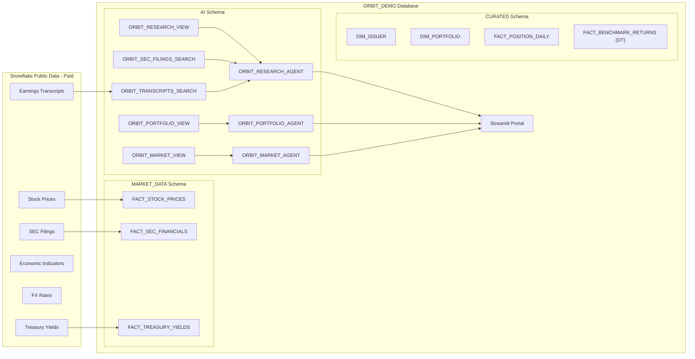

# ORBIT Investment Intelligence

**Omnicient Reasoning Barclays Intelligence Tool**

A lean, SQL-first investment intelligence platform powered by Snowflake Cortex Agents, real-time market data, and a branded Streamlit portal.

## Architecture



## What's Included

| Component | Count | Description |
|-----------|-------|-------------|
| Market Data Tables | 10 | Real data from Snowflake Public Data (Paid) |
| Dimension Tables | 4 | Company reference, portfolios, benchmarks |
| Dynamic Tables | 2 | Auto-refreshing benchmark and sector returns |
| Cortex Search Services | 2 | SEC filings + earnings transcripts (RAG) |
| Semantic Views | 3 | Market, Research, Portfolio (text-to-SQL) |
| Cortex Agents | 3 | Research, Portfolio, Market Intelligence |
| Streamlit App | 1 | Multi-page branded portal |

## Prerequisites

1. **Snowflake account** with Cortex AI features enabled
2. **Snowflake Public Data (Paid)** listing installed:
   [Marketplace Listing](https://app.snowflake.com/marketplace/listing/GZTSZ290BUXPL)
3. **ACCOUNTADMIN** role for initial setup

## Deployment (5-10 minutes)

Run each script in a Snowsight worksheet, in order:

```
1. scripts/01_setup.sql         -- Infrastructure
2. scripts/03_curated.sql       -- Dimensions (run BEFORE market data)
3. scripts/02_market_data.sql   -- Market data tables
4. scripts/04_search_services.sql -- Search services
5. scripts/05_semantic_views.sql  -- Semantic views
6. scripts/06_agents.sql        -- Agents
7. scripts/07_refresh.sql       -- Daily refresh pipeline
```

**Important:** Run `03_curated.sql` before `02_market_data.sql` because market data tables reference `DIM_ISSUER`.

## Streamlit Portal

After deployment, deploy the Streamlit app:

```sql
PUT file://streamlit/orbit_portal.py @ORBIT_DEMO.AI.STREAMLIT_STAGE/orbit_portal AUTO_COMPRESS=FALSE OVERWRITE=TRUE;
PUT file://streamlit/pages/* @ORBIT_DEMO.AI.STREAMLIT_STAGE/orbit_portal/pages AUTO_COMPRESS=FALSE OVERWRITE=TRUE;
PUT file://streamlit/.streamlit/config.toml @ORBIT_DEMO.AI.STREAMLIT_STAGE/orbit_portal/.streamlit AUTO_COMPRESS=FALSE OVERWRITE=TRUE;

CREATE OR REPLACE STREAMLIT ORBIT_DEMO.AI.ORBIT_PORTAL
    ROOT_LOCATION = '@ORBIT_DEMO.AI.STREAMLIT_STAGE/orbit_portal'
    MAIN_FILE = 'orbit_portal.py'
    QUERY_WAREHOUSE = 'ORBIT_DEMO_WH'
    COMMENT = 'ORBIT Investment Intelligence Portal';
```

## Data Sources

All data is **real** — sourced from the Snowflake Public Data (Paid) listing:

- **Stock prices**: Nasdaq via Cybersyn (14,000+ securities, near-real-time)
- **SEC financials**: XBRL filings (income statement, balance sheet, cash flow)
- **Revenue segments**: SEC business/geographic segment data
- **Treasury yields**: US Treasury par yield curve (daily)
- **Economic indicators**: FRED (GDP, CPI, unemployment, fed funds)
- **Policy rates**: BIS central bank rates
- **FX rates**: Major currency pairs
- **Insider trades**: SEC Form 4 filings
- **Institutional holdings**: SEC 13F filings
- **Earnings transcripts**: Company earnings calls
- **SEC filing text**: 10-K, 10-Q, 8-K full text

## Agents

| Agent | Tools | Use For |
|-------|-------|---------|
| **ORBIT Research** | Semantic View + SEC Search + Transcript Search | Company deep-dives, financial analysis, management commentary |
| **ORBIT Portfolio** | Semantic View | Holdings, allocation, sector exposure, performance |
| **ORBIT Market** | Semantic View | Yields, FX, economic data, policy rates, stock prices |

Access via Snowflake Intelligence (CoWork) or the Streamlit portal's deep-link buttons.

## Brand

- Primary: `#1B6B93` (deep teal)
- Secondary: `#2E8BC0` (medium teal)
- Accent: `#5DADE2` (light blue)
- Dark background: `#1B2838`
- Logo files in `assets/logos/`
