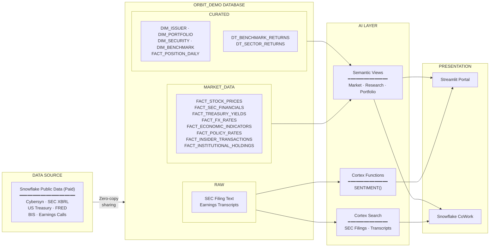

# Architecture & Data Model

## System Overview

ORBIT Investment Intelligence is built entirely on Snowflake with zero external infrastructure. The architecture follows a three-layer pattern:



---

## Database Schema: ORBIT_DEMO

### CURATED Schema — Dimensions & Derived

| Table | Type | Description |
|-------|------|-------------|
| `DIM_ISSUER` | Dimension | 3,500+ companies (NYSE/NASDAQ) with GICS sector mapping |
| `DIM_SECURITY` | Dimension | One equity per issuer |
| `DIM_PORTFOLIO` | Dimension | 11 model portfolios with strategy/benchmark metadata |
| `DIM_BENCHMARK` | Dimension | Benchmark index definitions |
| `FACT_POSITION_DAILY` | Fact | Portfolio holdings with weights, shares, values |
| `DT_BENCHMARK_RETURNS` | Dynamic Table | Auto-refreshing benchmark return calculations |
| `DT_SECTOR_RETURNS` | Dynamic Table | Auto-refreshing sector performance |

### MARKET_DATA Schema — Source Market Data

| Table | Source | Records | Description |
|-------|--------|---------|-------------|
| `FACT_STOCK_PRICES` | Cybersyn/Nasdaq | ~10M | Daily OHLCV for all issuers |
| `FACT_SEC_FINANCIALS` | SEC XBRL | ~50K | Quarterly + annual income/balance/cash flow |
| `FACT_SEC_SEGMENTS` | SEC XBRL | ~20K | Revenue by business/geographic segment |
| `FACT_TREASURY_YIELDS` | US Treasury | ~15K | Par yield curve (14 maturities, 3 years) |
| `FACT_ECONOMIC_INDICATORS` | FRED | ~10K | GDP, CPI, unemployment, rates |
| `FACT_FX_RATES` | BIS | ~47K | 130+ currencies vs USD |
| `FACT_POLICY_RATES` | BIS | ~5K | Central bank policy rates |
| `FACT_INSIDER_TRANSACTIONS` | SEC Form 4 | ~500K | Insider buys/sells |
| `FACT_INSTITUTIONAL_HOLDINGS` | SEC 13F | ~2M | Institutional ownership |
| `FACT_COUNTRY_EMISSIONS` | UN/Climate | ~5K | ESG emissions data |

### AI Schema — Intelligence Layer

| Object | Type | Description |
|--------|------|-------------|
| `ORBIT_RESEARCH_VIEW` | Semantic View | Maps to SEC financials, insiders, holders |
| `ORBIT_PORTFOLIO_VIEW` | Semantic View | Maps to positions, portfolios, benchmarks |
| `ORBIT_MARKET_VIEW` | Semantic View | Maps to prices, yields, FX, economic data |
| `ORBIT_SEC_FILINGS_SEARCH` | Cortex Search | RAG over 10-K, 10-Q, 8-K full text |
| `ORBIT_TRANSCRIPTS_SEARCH` | Cortex Search | RAG over earnings call transcripts |
| `ORBIT_RESEARCH_AGENT` | Agent | Multi-tool: Analyst + 2 Search services |
| `ORBIT_PORTFOLIO_AGENT` | Agent | Single-tool: Portfolio Analyst |
| `ORBIT_MARKET_AGENT` | Agent | Single-tool: Market Analyst |

### RAW Schema — Unstructured Corpus

| Table | Description |
|-------|-------------|
| `SEC_FILING_TEXT` | Full text of SEC 10-K, 10-Q, 8-K filings |
| `EARNINGS_TRANSCRIPTS_CORPUS` | Earnings call transcripts with metadata |

---

## Data Flow

```
Snowflake Public Data (Paid)
         │
         ▼  (zero-copy access)
   scripts/02_data.sql
         │
         ├── DIM_ISSUER (active NYSE/NASDAQ with SIC→GICS mapping)
         ├── FACT_STOCK_PRICES (filtered to our universe)
         ├── FACT_SEC_FINANCIALS (pivoted XBRL with computed margins)
         ├── FACT_TREASURY_YIELDS (parsed maturities, ordered)
         ├── ... (other fact tables)
         │
         ▼
   scripts/03_search_services.sql
         │
         ├── ORBIT_SEC_FILINGS_SEARCH (hybrid text + vector)
         └── ORBIT_TRANSCRIPTS_SEARCH (hybrid text + vector)
         │
         ▼
   scripts/04_semantic_views.sql
         │
         ├── ORBIT_MARKET_VIEW
         ├── ORBIT_RESEARCH_VIEW
         └── ORBIT_PORTFOLIO_VIEW
         │
         ▼
   scripts/05_agents.sql
         │
         ├── ORBIT_RESEARCH_AGENT (Analyst + 2 Search)
         ├── ORBIT_PORTFOLIO_AGENT (Analyst only)
         └── ORBIT_MARKET_AGENT (Analyst only)
         │
         ▼
   scripts/06_refresh.sql
         │
         ├── DT_BENCHMARK_RETURNS (Dynamic Table)
         ├── DT_SECTOR_RETURNS (Dynamic Table)
         └── ORBIT_DAILY_REFRESH (Scheduled Task)
```

---

## Security Model

| Role | Purpose | Grants |
|------|---------|--------|
| `ORBIT_DEMO_ROLE` | All demo operations | Full access to ORBIT_DEMO database |
| `ORBIT_DEMO_WH` | General compute | Standard warehouse for queries |
| `ORBIT_DEMO_SEARCH_WH` | Search indexing | Scaled up for initial Cortex Search build |

The demo uses a single role for simplicity. In production, you would separate:
- Data engineering role (write access)
- Analyst role (read + agent access)
- Viewer role (Streamlit + CoWork only)

---

## Key Design Decisions

1. **No staging tables for search** — Cortex Search queries source data directly via JOINs, eliminating ETL and storage duplication.

2. **Computed margins with fallback** — `GROSS_MARGIN_PCT` uses `COALESCE(GrossProfit, Revenue - CostOfRevenue)` because many tech companies don't report the GrossProfit XBRL tag.

3. **Latest-per-entity pattern** — FX rates and indicators use `QUALIFY ROW_NUMBER() OVER (PARTITION BY ... ORDER BY DATE DESC) = 1` instead of `WHERE DATE = MAX(DATE)` to handle staggered data.

4. **Altair for ordered categoricals** — Streamlit's native `st.bar_chart` alphabetically sorts string x-axes. We use `alt.X(..., sort=None)` to preserve data order (critical for yield curves).

5. **Period-flexible analysis** — Earnings and margins support Quarterly, YTD, and Annual views computed from the same underlying query, with QoQ/YoY comparison toggles.
